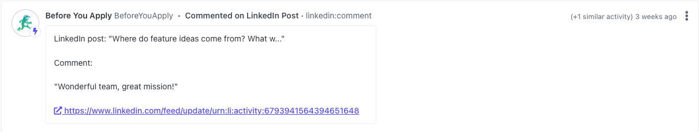

# LinkedIn Integration Template
> Automate integrating LinkedIn interactions into your Orbit workspace with this GitHub Actions template

There is one check included in the LinkedIn automation template, it occurs once a day:

1. Check for new organization post comments

If there are new comments they will be added to your Orbit workspace as new activities.

To use this workflow:

* Copy the [linkedin.yml](https://github.com/orbit-love/github-actions-templates/blob/main/LinkedIn/linkedin.yml) file into your own GitHub repository inside your `.github/workflows` directory

* The automation requires your LinkedIn and Orbit credentials be added to your GitHub repository secrets.
    * Follow the steps in the [GitHub Actions Templates First Time Setup Guide](https://github.com/orbit-love/github-actions-templates/blob/main/FIRST_TIME_SETUP.md) and add the following two additional secrets:
        * `LINKEDIN_ORGANIZATION`: Your LinkedIn organization ID, i.e. if your LinkedIn URL is https://linkedin.com/company/28866695 then your ID is `urn:li:organization:28866695`
        * `LINKEDIN_TOKEN`: Your LinkedIn token. Follow the [First Time Setup Guide](https://github.com/orbit-love/community-ruby-linkedin-orbit/blob/main/docs/FIRST_TIME_INSTRUCTIONS.md) to obtain it if you have not done so previously.

* This workflow will automatically filter out any LinkedIn comments that are older than the most recent LinkedIn comment in your Orbit workspace currently.
    * To perform a historical import, that will send to Orbit **all** of your LinkedIn comments add the `--historical-import` flag to the workflow file on line 24: `linkedin_orbit --check-comments --historical-import`
    * **You should only need to run a historical import once, and it is recommended to remove the `--historical-import` flag after.**

Once the workflow and credentials have been added to your GitHub repository, the workflow will be activated. You do not need to do anything else to activate it.
