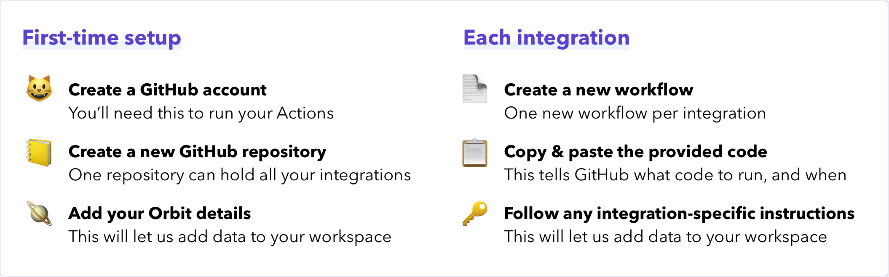

# GitHub Actions Templates

Automate community integrations for your Orbit workspace with these GitHub Actions template starter files

# Overview

This repository helps you get up and running with third party integrations to Orbit in a matter of minutes.

Inside this repository are template YAML workflow files you can use to automate **third party integrations** with your Orbit workspace.

**What are 3rd party integrations?**

All Orbit users have access to [built-in integrations](https://orbit.love/integrations/), such as GitHub, Twitter, Slack, and Discord. These built-in integrations can be added and set up from within the Orbit app.

Community-built, or 3rd party integrations, are additional integrations offered by the larger Orbit community. While not officially supported, they offer many opportunities to further extend the utility of the platform.

**What is this repository for?**

Within each subfolder of this repository is a GitHub Actions workflow template file, along with instructions on how to use it. GitHub Actions is a runtime environment provided by GitHub to any GitHub user. You can run applications on GitHub Actions for free on any publicly available (*not private*) repository.

# Available Integrations

The following integration workflows are available to use, and more will be added:

| Platform | Features |
|---|---|
| [DEV Community](https://github.com/orbit-love/github-actions-templates/blob/main/DEV/README.md) | <ul><li>New followers</li><li>New comments</li></ul> |
| [Stack Overflow](https://github.com/orbit-love/github-actions-templates/blob/main/StackOverflow/README.md) | <ul><li>New questions with tag</li></ul> |
| [LinkedIn](https://github.com/orbit-love/github-actions-templates/blob/main/LinkedIn/README.md) | <ul><li>New comments on posts</li></ul> |
| [YouTube](https://github.com/orbit-love/github-actions-templates/blob/main/YouTube/README.md) | <ul><li>New comments across all videos on a channel</li></ul> |
| [Pipedrive](https://github.com/orbit-love/github-actions-templates/blob/main/Pipedrive/README.md) | <ul><li>New notes on deals</li></ul> |

To use a workflow, please follow the integration-specific instructions.

# Contributing

We :heart:  contributions! Please read the [Contribution Guidelines](.github/CONTRIBUTING.md) on how to get involved and submit your own 3rd party integration template.

# Code of Conduct

This project has a [Contributor Code of Conduct](.github/CODE_OF_CONDUCT.md). We ask everyone to please adhere by its guidelines.

# License

This project is under the [MIT License](LICENSE).
