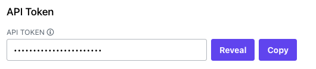
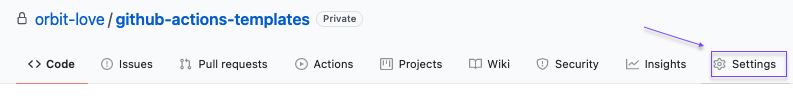
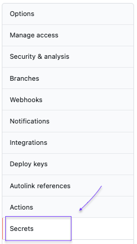
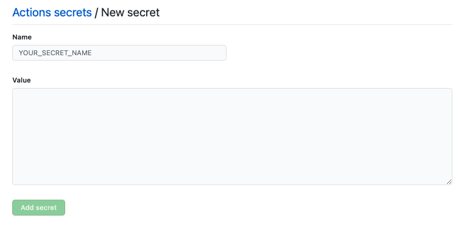

# GitHub Actions Templates
> Automate community integrations for your Orbit workspace with these GitHub Actions template starter files

# Table of Contents
* [Overview](#overview)
    * [Adding Your Credentials to GitHub](#adding-your-credentials-to-github)
* [Integration Instructions](#integration-instructions)
    * [DEV](#dev)
* [Contributing](#contributing)
* [Code of Conduct](#code-of-conduct)
* [License](#license)

# Overview

Inside this repository are template YAML workflow files you can use to automate **3rd party integrations** with your Orbit workspace.

**What are 3rd party integrations?**

All Orbit users have access to a host of [built-in integrations](https://orbit.love/integrations/), such as GitHub, Twitter, Slack, Discord and others. These built-in integrations can be added and set up from within the Orbit app.

Community-built, or 3rd party integrations, are additional integrations offered by the larger Orbit community. While not officially supported, they offer many opportunities to further extend the utility of the platform. 

**What is this repository for?**

Within each subfolder of this repository is a GitHub Actions workflow template file, along with instructions on how to use it. GitHub Actions is a runtime environment provided by GitHub to any GitHub user. You can run applications on GitHub Actions for free on any publicly availably (*not private*) repository.

**What integration templates are available here?**

Currently, this repository contains integration templates for:

* [DEV Community](https://github.com/orbit-love/github-actions-templates/blob/main/DEV)

**How do I use these template files?**

To use these automation templates, you need to have:

* [GitHub Account](https://github.com/join)
* [GitHub Repository](https://docs.github.com/en/github/getting-started-with-github/create-a-repo), that you can name after the integration, e.g. `dev-orbit-integation`
* [Orbit Account](https://app.orbit.love/signup)

Once you have those items, you can navigate to the subfolder of the template you want to use, and follow the instructions inside the `README` in that subfolder.

All of the integration templates require adding your Orbit credentials to GitHub. The instructions to do so are in the next section of this document.
## Adding Your Credentials to GitHub

All of the automation templates require credentials be added to your GitHub repository in the Secrets menu. Each integration has its own specific credentials that will need to be added. All of them require your Orbit API key and your Orbit workspace ID.

Your Orbit API key can be find in your Orbit workspace by clicking on the picture of your avatar on the top left-hand corner, and then navigating to `Account Settings`:

Your Orbit workspace ID is the part of your Orbit workspace URL that immediately follows the `app.orbit.love`. For example, if the URL was `https://app.orbit.love/my-workspace`, then your Orbit workspace ID is `my-workspace`.

Follow these steps to add your `ORBIT_API_KEY` and `ORBIT_WORKSPACE_ID` to your GitHub repository secrets:

* Navigate to the `Settings` section in your GitHub repository:

* Then, click on the `Secrets` link from the side navigation bar:

    
* Once you are on the Secrets page, click on the `New repository secret` button:

* Then, fill out the prompt with your credential information:

> **Repeat the new secret step for each unique secret:**
* `ORBIT_API_KEY`: Your Orbit API key
* `ORBIT_WORKSPACE_ID`: Your Orbit workspace ID
* ... other secrets for specific integrations
# Integration Instructions

The following integration workflows are available to use, and more will be added:

* [DEV Community Blog](https://github.com/orbit-love/github-actions-templates/blob/main/DEV/INSTRUCTIONS.md)

To use a workflow, please read the instructions in the section pertaining to that integration.
# Contributing

We :heart:  contributions! Please read the [Contribution Guidelines](CONTRIBUTING.md) on how to get involved and submit your own 3rd party integration template.
# Code of Conduct

This project has a [Contributor Code of Conduct](CODE_OF_CONDUCT.md). We ask everyone to please adhere by its guidelines.

# License

This project is under the [MIT License](LICENSE).